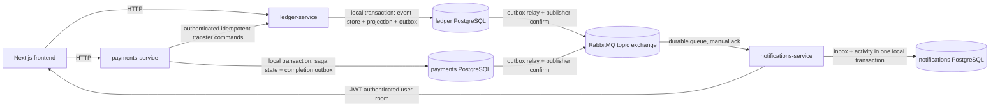

# P2P Ledger — стартовий репозиторій

Це стартовий каркас для тестового завдання (`ТЗ_тестове_завдання_6`). Частина
сервісів уже працює, частина — лише каркас або TODO. Повний опис завдання —
у файлі ТЗ, який ви отримали окремо.

## Що вже працює

- `apps/ledger-service` — автентифікація, event-sourced wallets, double-entry
  journal, CQRS balance/hold projection та admin reconciliation API.
- `apps/payments-service` — durable transfer creation, authenticated sender
  context, PostgreSQL-backed `Idempotency-Key`, orchestrated saga, recovery
  worker, split bills та transactional integration outbox.
- `apps/notifications-service` — durable RabbitMQ consumer/inbox, persisted
  owner-scoped activity feed та JWT-authenticated WebSocket fan-out.
- `apps/frontend` — сторінки логіну, реєстрації та список гаманців (Next.js
  App Router, Server Component + API-роут-проксі для авторизації).

## Що ще НЕ реалізовано

- FX та fraud/limit provider ще не реалізовані;
  same-currency transfer rules перевіряються ledger-service.
- Форма переказу, split-bill UI та admin-екран на фронтенді.

## Multi-service infrastructure



Кожен backend container отримує credentials лише своєї database і приєднаний
лише до її private Docker network. У коді
`payments-service` і `notifications-service` немає ledger entities або
connection settings; cross-service state надалі передається лише versioned
HTTP contracts чи integration events. XA/distributed transactions не
використовуються.

### ADR: RabbitMQ як event broker

Обрано RabbitMQ 3.13 з durable topic exchange `p2p.domain-events`.

- Kafka дає сильний distributed log і високий throughput, але для локального
  test project із трьома сервісами потребує непропорційно складнішої
  експлуатації, partition/retention design та важчого Compose startup.
- Redis Streams може забезпечити consumer groups, але незалежний fan-out,
  routing, reclaim pending messages і dead-letter policy потребують більше
  application-level coordination.
- RabbitMQ прямо надає durable queues, topic routing, publisher confirms,
  manual acknowledgements, prefetch та redelivery. Разом з outbox/inbox це дає
  потрібну at-least-once delivery semantics з мінімальною operational cost.

RabbitMQ не робить delivery exactly-once: duplicate після publish-before-mark
crash очікуваний і нейтралізується durable consumer inbox.

### Database topology

- `ledger-db` / database `ledger`: users, wallets, immutable event store,
  projections та `integration_outbox`;
- `payments-db` / database `payments`: durable transfers, split bills/shares,
  reminders, окремі migration history, `integration_outbox` і
  `processed_messages` foundation;
- `notifications-db` / database `notifications`: `processed_messages` та
  `activity_feed`.

Це окремі PostgreSQL containers і volumes, а не просто різні credentials до
одного shared database instance.

### Durable transfer creation та idempotency

`POST /transfers` вимагає bearer JWT і непорожній `Idempotency-Key` (до 200
символів). Sender user береться з JWT principal; client передає лише source
wallet reference. Request нормалізується до canonical форми
`senderUserId/fromWalletId/receiver/amountMinor/currency`, а її SHA-256
зберігається у `request_fingerprint`.

Unique constraint `(sender_user_id, idempotency_key)` є фінальною concurrency
гарантією. Перший request вставляє `Pending` transfer. Повтор із тим самим hash
повертає той самий transfer, а reuse key з іншим hash повертає `409 Conflict`.
У concurrent race лише один INSERT проходить constraint; loser перечитує
persisted winner і застосовує ту саму hash-перевірку. Тому гарантія переживає
restart і не залежить від in-memory state.

Transfer status має explicit дозволені переходи:

```text
Pending -> Validating -> FundsHeld -> Processing -> Completed
                     \             \-> Compensating -> Failed
                      \-> Failed
Pending -> Failed
```

`Completed` і `Failed` terminal. State update використовує optimistic entity
version та умову на попередні status/version.

### Split bills

`payments-service` зберігає `split_bills` та allocation rows у
`split_bill_shares`. Суми API передаються canonical decimal strings формату
`0.00`, одразу конвертуються у integer minor units (`bigint`) і надалі не
обчислюються через floating point. Custom split приймається лише коли сума всіх
shares точно дорівнює total. Equal split детерміновано розподіляє cent remainder
за persisted participant `position` (наприклад `10.00 / 3` → `3.34`, `3.33`,
`3.33`).

API:

- `POST /split-bills` — створення equal/custom bill; creator identity береться
  з JWT, а receiver reference — з authenticated email, не request body;
- `GET /split-bills/:id` — доступ creator або participant;
- `POST /split-bills/:billId/shares/:shareId/pay` — participant передає свій
  source wallet та обов'язковий `Idempotency-Key`.

Share payment створює звичайний `transfers` row, після чого запускається той
самий hold/settle/compensation saga та ledger API. Unique constraint
`transfers(split_bill_share_id)` гарантує один logical payment на share навіть
при concurrent requests. Amount, currency і receiver wallet беруться з bill,
не з pay request. Share вважається paid виключно коли пов'язаний transfer має
terminal `Completed`; `Failed` не змінює financial/aggregate state.

Bill status не є другим mutable source of truth, а обчислюється зі shares:

```text
0 completed transfers -> Pending
some completed transfers -> PartiallyPaid
all completed transfers -> Settled
```

Optional `deadline` обробляє recovery-safe reminder worker. Його interval,
batch size та enable flag задаються `SPLIT_BILL_REMINDER_*`. Для overdue share
без active/successful payment worker атомарно записує unique durable reminder і
`payments.split-bill.ShareOverdue` у payments outbox. Notifications consumer
deduplicate-ить event за `eventId` та створює activity лише participant user.

### ADR: orchestrated transfer saga

`payments-service` є власником transfer lifecycle, тому orchestration розміщена
саме тут. Це залишає ledger власником лише фінансових invariants та event
history, а notifications — downstream consumer. Choreography для короткого
послідовного flow ускладнила б визначення timeout/compensation owner і recovery
stuck transfers без додаткової користі.

```text
Pending
  -> Validating
  -> FundsHeld
  -> Processing
  -> Completed

Validating/FundsHeld/Processing
  -> Compensating
  -> Failed

Compensating --ledger reports already settled--> Completed
```

Saga state, resolved receiver wallet, retry counters, next retry time,
`hold_may_exist` та expiring worker lease зберігаються в payments PostgreSQL.
Recovery worker claim-ить due transfer через `FOR UPDATE SKIP LOCKED`; external
commands залишаються idempotent, тому lease expiry або duplicate worker delivery
не створюють повторного monetary effect.

### Compensation matrix

- **Validate receiver/rules.** Success зберігає resolved receiver wallet.
  Retryable network/5xx/429/timeout отримує bounded HTTP retry, потім persisted
  exponential retry. Definitive 4xx до hold завершує transfer як `Failed`.
  Compensation не потрібна.
- **Place hold.** Success переводить у `FundsHeld`. Command ID дорівнює transfer
  ID, тому retry не створює другий hold. Timeout вважається ambiguous і
  `hold_may_exist` записується до HTTP call. Після вичерпання step attempts saga
  переходить у `Compensating` і виконує idempotent release.
- **Settle.** Ledger в одній local transaction consume-ить sender hold, credit-ить
  receiver stream, оновлює обидві projections/outboxes та пише unique settlement
  receipt за transfer ID. Retryable failure повторює той самий command. Terminal
  failure або exhausted ambiguous attempts запускає release. Якщо settlement
  фактично committed до timeout, release повертає `already_settled`, і saga
  безпечно завершується `Completed`.
- **Release/compensation.** `released` або відсутній hold дає `Failed` без зміни
  total balance; `already_settled` дає `Completed`. Будь-яка недоступність ledger
  залишає persisted `Compensating` з наступним retry — hold не губиться в
  terminal state без recovery path.
- **Publish completion.** `Completed` state і versioned
  `payments.transfer.completed.v1` записуються атомарно з payments outbox.
  Publisher confirm, lease та backoff забезпечують at-least-once delivery;
  consumers дедуплікують за `eventId`.

Ledger HTTP adapter має per-attempt timeout, bounded exponential retry та
process-local circuit breaker. Circuit-open є retryable результатом для
persisted saga; correctness не залежить від пам'яті circuit breaker.

### Versioned integration event contract

Canonical JSON Schemas лежать у `contracts/integration-events/v1`. Envelope
містить `eventId`, `eventType`, `schemaVersion`, `occurredAt`, producer,
correlation/trace context, aggregate type/id/version та payload. Wallet payload
додатково містить owner ID, currency і persisted domain-event type/schema/data.

Routing keys versioned окремо, наприклад
`ledger.wallet.money-deposited.v1`. Зміна несумісної форми створює нову schema
version/routing binding; persisted v1 message не переписується.

### Transactional outbox і retry

Ledger command виконує в одній local PostgreSQL transaction:

```text
append domain event -> update projection -> insert integration_outbox -> commit
```

Outbox relay атомарно claim-ить due rows короткою lease через
`FOR UPDATE SKIP LOCKED`, публікує persistent message і чекає RabbitMQ publisher
confirm. Лише після confirm ставиться `published_at`. Failure залишає row
pending, збільшує attempts і призначає bounded exponential backoff. Crash після
broker confirm, але до DB mark, може повторити publish — це навмисна
at-least-once поведінка без втрати event.

### Consumer inbox/deduplication

Notifications consumer підписаний на versioned contracts за routing keys
`ledger.#` і `payments.#`, використовує durable queue і manual ack. Перед side
effect він виконує `INSERT ... ON CONFLICT DO NOTHING` у `processed_messages`.
Inbox marker та activity-feed insert знаходяться в одній notifications DB
transaction. Ack відправляється лише після commit; duplicate `eventId`, у тому
числі після restart process, не повторює activity item або socket fan-out.
Malformed envelopes потрапляють у dead-letter queue, а transient handler
failure requeue-ить message. Після broker disconnect consumer використовує
bounded exponential reconnect і повторно оголошує exchange, queue та bindings.

### Activity feed та real-time delivery

`GET /activity` вимагає bearer JWT і завжди бере `userId` з authenticated
principal. Endpoint підтримує `limit` (1–100), opaque cursor pagination та
optional exact `eventType` filter. Composite DB index підтримує owner/type/time
query; notifications DB не містить balance чи transfer source-of-truth tables.

Socket.IO namespace `/activity` також вимагає access JWT: browser може передати
його через `auth.token`, bearer header або існуючу httpOnly `accessToken` cookie.
Server сам додає socket лише до room `user:<JWT sub>`; client не може вибрати
іншого user/channel. Після durable DB commit новий item надсилається як
`activity` тільки цьому room.

WebSocket є лише latency optimization. Після reconnect клієнт повторно читає
authoritative transfer status у payments-service, wallet balance у
ledger-service та durable feed через `/api/activity` (BFF proxy до
notifications-service). Тому crash у вузькому проміжку після DB commit і до
socket emit може пропустити push, але не activity record і не authoritative
financial state.

## Запуск

```bash
docker-compose up --build
```

- ledger-service: http://localhost:3001
- payments-service: http://localhost:3002
- notifications-service: http://localhost:3003
- notifications Socket.IO namespace: `http://localhost:3003/activity`
- authenticated recent activity: `GET http://localhost:3003/activity`
- frontend: http://localhost:3000

Для локальної розробки без Docker: скопіюйте `.env.example` → `.env` у
кожному сервісі, підніміть Postgres окремо, `npm ci && npm run start:dev`
у потрібному сервісі.

Кожен app є окремим npm package і має власний `package-lock.json`. Для
відтворюваного install локально, у CI та Docker використовується `npm ci`.

## Тести

```bash
cd apps/ledger-service && npm test
```

Не всі тести в репозиторії однаково надійні — це навмисно, дивись ТЗ.

## Знайдені проблеми стартового коду

### IDOR у wallet endpoints

- **Проблема:** authenticated user міг прочитати або змінити чужий гаманець,
  якщо знав його ID.
- **Причина:** `GET /wallets/:id`, `POST /wallets/:id/deposit` і
  `POST /wallets/:id/withdraw` перевіряли JWT, але шукали гаманець лише за ID,
  без перевірки власника.
- **Відтворення:** автентифікуватися як user A та передати ID гаманця user B в
  один із цих endpoint-ів.
- **Доказ:** regression-тести перевіряють owner-доступ, відмову іншому
  користувачу для всіх трьох операцій і передачу identity саме з JWT principal.
- **Виправлення:** controller передає `req.user.userId`, а service виконує один
  owner-scoped lookup за `{ id, ownerId }`. Неіснуючий і чужий гаманець
  послідовно повертають `404`, не розкриваючи існування ресурсу.

### Wallet lifecycle і дублікати

- **Модель starter code:** wallet створюється ліниво при першому
  `GET /wallets` користувача. Поточна default currency — `USD`.
- **DB-інваріант:** у таблиці `wallets` діє unique index на
  `(ownerId, currency)`. Це дозволяє додавати інші валюти пізніше, але не
  дозволяє два логічно однакові wallets одного користувача.
- **Конкурентне створення:** service виконує insert, а PostgreSQL constraint є
  остаточною гарантією. Caller, який отримав unique violation `23505`, перечитує
  вже створений wallet. Інші database errors не приховуються.
- **Валідація amount:** deposit/withdraw приймають лише додатне скінченне число
  з не більш ніж двома десятковими знаками. `0`, negative, `NaN`, `Infinity`,
  numeric strings і malformed strings відхиляються. Global whitelist видаляє
  поля без validation decorators, тому `ownerId` або `balance` з body не
  потрапляють у DTO.

### False-positive insufficient-funds test

- **Проблема:** початковий withdraw test викликав Promise без `await` або
  `return` і додавав assertion лише всередині `.catch()`. Якщо `withdraw()`
  помилково resolve-ився, assertion не виконувався, але test міг бути зеленим.
- **Виправлення:** test очікує rejected Promise через `await expect(...).rejects`,
  перевіряє `BadRequestException`, повідомлення `Недостатньо коштів` і те, що
  repository `save()` не викликався.
- **Додатковий захист:** успішні withdraw tests перевіряють змінений balance,
  об'єкт, переданий у `save()`, і boundary case повного списання до `0.00`.
- **Skip/TODO audit:** у поточному test tree не знайдено `.skip`, `xit`,
  `xdescribe`, `test.todo`, `it.todo` або TODO навколо tests.

### Concurrent wallet mutation / double spending

- **Проблема:** starter implementation виконував `SELECT balance`, перевірку в
  application memory і пізніший `save()`. Паралельні requests читали один
  старий balance та перезаписували результати один одного.
- **Відтворення:** PostgreSQL integration regression запускає 10 одночасних
  withdrawals по `30` з balance `100`. До виправлення всі 10 requests повертали
  success, а persisted balance був `40.00`. Десять одночасних deposits по `10`
  збільшували balance лише зі `100.00` до `110.00`.
- **Виправлення:** command replay-ить wallet stream, перевіряє invariant та
  append-ить event з expected stream version разом з projection update в одній
  TypeORM/PostgreSQL transaction. Unique `(stream_id, stream_version)` змушує
  конкурентного loser перечитати stream і повторити domain validation.
  Application mutex не використовується.
- **Гарантія:** два withdrawals по `80` з balance `100` дають рівно один
  success і final balance `20.00`; десять withdrawals по `30` дають максимум
  три success і final balance `10.00`. Insufficient operations не змінюють
  state, concurrent deposits не губляться, IDOR semantics залишаються `404`.
- **Запуск regression:** підняти dedicated PostgreSQL database
  `ledger_concurrency_test` на `127.0.0.1:55432`, потім виконати
  `cd apps/ledger-service && npm run test:integration:concurrency`.

### TypeORM metadata auth entity

Real-DB test виявив, що TypeORM не міг infer PostgreSQL type для
`User.refreshTokenHash: string | null`. Колонка тепер явно має type `varchar`,
тому production entities проходять DataSource initialization, а concurrency
integration test перевіряє саме production `User` і `Wallet` metadata.

### Docker production entrypoint

- **Проблема:** clean Docker build успішно компілював Nest services, але
  container завершувався з `Cannot find module '/app/dist/main'`.
- **Причина:** через поточний TypeScript project layout clean output має
  entrypoint `dist/src/main.js`; локальний stale `dist/main.js` маскував defect.
- **Виправлення:** `start:prod` і Docker `CMD` усіх трьох backend services
  використовують фактичний clean-build path. Ізольований Compose smoke test
  підтверджує startup трьох processes, migrations і broker connection.

## Event Store foundation

`ledger-service` має PostgreSQL-backed append-only таблицю `ledger_events`.
Wallet financial history тепер є source of truth у цьому Event Store; public
wallet API зберігає попередню форму відповіді з decimal `balance`, але значення
читається з CQRS projection, а не з mutable колонки `wallets.balance`.

### Схема event record

- `event_id UUID` — глобальний primary key події;
- `stream_id UUID` + `stream_version INTEGER` — identity та послідовність
  aggregate stream, захищені unique constraint;
- `aggregate_type`, `event_type`, `schema_version` — тип aggregate, тип події
  та версія її persisted schema;
- `payload JSONB`, `metadata JSONB` — domain data і технічний контекст;
- nullable `correlation_id`, `trace_id` — зв'язок із command/trace;
- `created_at TIMESTAMPTZ` — database timestamp append-у.

Positive check constraints діють для `stream_version` та `schema_version`.
PostgreSQL trigger `ledger_events_append_only` відхиляє `UPDATE` і `DELETE` з
SQLSTATE `55000`: виправлення історії мають бути лише новими compensating
events. `TRUNCATE` використовується виключно для ізольованого test database.

### Append і optimistic concurrency

`EventStoreService.append()` приймає `streamId`, `aggregateType`,
`expectedVersion` та один або кілька events. В одній local DB transaction він:

1. читає поточну версію stream;
2. перевіряє expected version та незмінність aggregate type;
3. призначає послідовні stream versions;
4. вставляє весь batch одним atomic insert.

Unique constraint `(stream_id, stream_version)` є остаточною гарантією race:
два concurrent commands з одним expected version не можуть обидва commit-нутись.
Конфлікт повертається як `ExpectedStreamVersionError`; глобальний duplicate
`event_id` — як `DuplicateEventIdError`. Помилка будь-якої події відкочує весь
batch. `loadStream()` завжди читає за `stream_version ASC`, а `replay()`
застосовує переданий deterministic reducer до persisted payload.

`event_type + schema_version` є contract для майбутніх version-specific
handlers/upcasters: значення старих подій не переписуються. Upcaster registry
ще не потрібен і на цьому етапі не реалізований.

### Migrations

Production configuration більше не використовує `synchronize: true`.
Checked-in migrations створюють базові starter tables та `ledger_events`;
`migrationsRun: true` застосовує їх під час startup. Для явного запуску:

```bash
cd apps/ledger-service
npm run migration:run
```

Migration `CreateLedgerBaseSchema1725000000000` безпечно приймає database зі
старими synchronize-created `users`/`wallets`, а
`CreateLedgerEvents1725000001000` створює Event Store constraints, index і
append-only trigger.

### Wallet aggregate, journal і CQRS projection

Один wallet відповідає stream `aggregate_type=Wallet`. Aggregate replay-ить:

- `WalletCreated` — identity власника й currency;
- `MoneyDeposited` — завершене зовнішнє поповнення;
- `WithdrawalCompleted` — завершене зовнішнє списання.

Кожна monetary event містить `transactionId` і signed postings. Поповнення має
`+amount` на `wallet:<walletId>` та `-amount` на `system:external`; withdrawal —
навпаки. Domain layer відхиляє transaction, якщо postings менше двох або їхня
сума не дорівнює нулю. Amount зберігається як integer minor units у string
формі всередині JSON, щоб не залежати від floating-point replay.

Write path авторизує owner, replay-ить aggregate, перевіряє balance та journal
invariant, append-ить event з expected stream version і в тій самій PostgreSQL
transaction оновлює `wallet_balance_projection`. Read path (`list/get`) читає
projection. Projection містить `balance_minor` і оброблену `stream_version`,
тому її можна детерміновано перебудувати з wallet stream.

Migration `EventSourceWalletBalances1725000002000` конвертує кожен legacy
`wallets.balance` у `WalletCreated` та, для ненульового balance, balanced
`MoneyDeposited` event, створює projection і видаляє стару колонку. Негативний
legacy balance або unsupported/unbalanced existing wallet event зупиняє
migration замість створення двох суперечливих джерел істини.

### Holds, rebuild і reconciliation

Hold lifecycle представлений immutable events `FundsHeld`, `HoldReleased` та
`HoldConsumed`. `FundsHeld` зменшує лише available balance; settlement
`HoldConsumed` створює balanced postings і тоді зменшує total balance. Формула
projection: `available_minor = balance_minor - held_minor`. PostgreSQL check
constraints забороняють negative held/available та projection, що порушує цю
формулу.

`holdId` є idempotency identity всередині wallet stream. Повторний place з тією
самою сумою, release уже released hold та consume уже consumed hold повертають
поточний state без нового event. Повторне використання ID з іншою сумою або
несумісний terminal transition відхиляється. Concurrent holds захищені тією
самою expected-version гарантією, що й withdraw, тому сума active holds не може
перевищити event-derived total.

Admin-only endpoints, захищені JWT guard та server-side `role=admin` guard:

- `GET /admin/ledger/wallets/:id/events` — chronological immutable stream;
- `GET /admin/ledger/reconciliation/wallets/:id` — event-derived state проти
  materialized projection;
- `GET /admin/ledger/reconciliation/global?from=&to=` — суми debit/credit
  postings за inclusive period;
- `POST /admin/ledger/projections/rebuild` — atomic deterministic rebuild усіх
  wallet projections із event streams.

Rebuild сортує wallets і replay-ить events у `stream_version ASC`; зовнішній
стан або поточний час у reducer не використовуються. Migration
`AddHeldBalanceProjection1725000003000` додає held/available поля та DB
constraints до існуючих projections.

## Відтворювана перевірка

CI використовує Node.js 20 та виконує `npm ci`, lint і build для всіх чотирьох
apps. Ledger job додатково запускає unit tests та PostgreSQL concurrency
integration tests. Payments job запускає unit, persistence, transfer
idempotency/concurrency, saga і split-bill integration tests; notifications job
запускає unit і persistence integration tests.

Локальний набір команд для кожного app:

```bash
cd apps/<app>
npm ci
npm run lint
npm run build
```

Для ledger додатково:

```bash
npm test -- --runInBand --no-watchman
npm run test:integration:concurrency
npm run test:integration:event-store
npm run test:integration:migration
```

Для service-owned persistence:

```bash
cd apps/payments-service
npm test -- --runInBand --no-watchman
npm run test:integration:persistence
npm run test:integration:transfers
npm run test:integration:saga
npm run test:integration:split-bills

cd ../notifications-service
npm test -- --runInBand --no-watchman
npm run test:integration:persistence
```

Infrastructure verification:

```bash
docker compose config --quiet
docker compose build ledger-service payments-service notifications-service
docker compose up -d
```

RabbitMQ management UI: `http://localhost:15672` (`p2p` / `p2p` для local
Compose example only). Production credentials мають надходити через secret
management, а не використовувати example values.

Остання команда очікує dedicated PostgreSQL database
`ledger_concurrency_test` на `127.0.0.1:55432`; налаштування можна змінити через
`TEST_DATABASE_*` environment variables.
