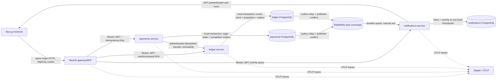

# P2P Ledger

## Project overview

Distributed P2P payments test project built from the supplied starter repository.
The ledger is event-sourced and double-entry; payments owns durable transfer and
split-bill workflows; notifications owns an idempotent activity feed and
user-scoped realtime delivery. A stateless NestJS BFF is the only
frontend-facing backend. PostgreSQL persistence is owned independently by each
service and RabbitMQ provides at-least-once integration-event delivery.

## Що вже працює

- `apps/ledger-service` — автентифікація, event-sourced wallets, double-entry
  journal, CQRS balance/hold projection та admin reconciliation API.
- `apps/payments-service` — durable transfer creation, authenticated sender
  context, PostgreSQL-backed `Idempotency-Key`, orchestrated saga, recovery
  worker, split bills та transactional integration outbox.
- `apps/notifications-service` — durable RabbitMQ consumer/inbox, persisted
  owner-scoped activity feed та JWT-authenticated WebSocket fan-out.
- `apps/gateway-service` — stateless NestJS BFF, який агрегує frontend reads,
  переносить JWT/idempotency context та ніколи не читає service databases.
- `apps/frontend` — Next.js App Router UI для auth, wallets, transfers,
  split bills, activity feed та admin inspection з reconnect/resync behavior.

## Що ще НЕ реалізовано

- Production-grade dashboards/alerting і централізоване log storage ще не
  налаштовані. Локальний Jaeger, OpenTelemetry traces, Prometheus-compatible
  `/metrics`, event log і reconciliation доступні для inspection.

## Architecture diagram



Кожен backend container отримує credentials лише своєї database і приєднаний
лише до її private Docker network. У коді
`payments-service` і `notifications-service` немає ledger entities або
connection settings; cross-service state надалі передається лише versioned
HTTP contracts чи integration events. XA/distributed transactions не
використовуються.

## Service boundaries

- `ledger-service` owns wallets, immutable event streams, journal postings,
  holds, balance projections, rebuild and reconciliation. It is the financial
  source of truth.
- `payments-service` owns transfers, API idempotency, saga/retry/compensation
  state and split bills. It calls ledger contracts and never reads ledger DB.
- `notifications-service` owns its durable inbox and activity feed, consumes
  versioned events and fans them out to authenticated user rooms. It is not an
  authoritative balance or transfer store.
- `gateway-service` is a database-free BFF. It forwards authenticated context,
  aggregates reads and contains no ledger or payments business decisions.

## Starter code

The existing NestJS services, TypeORM conventions, REST/JWT authentication,
Next.js App Router pages and npm-per-app layout were preserved. Mutable wallet
CRUD was incrementally refactored into an append-only event store, double-entry
journal and rebuildable projections because balance correctness could not be
made auditable through direct row mutation. Existing service skeletons were
extended rather than replaced; public wallet/auth routes were retained where
practical. RabbitMQ, service-owned databases, the BFF and observability wiring
were added where the assignment requires explicit service boundaries and
recoverable asynchronous delivery.

### ADR: NestJS BFF замість GraphQL

У starter repository не було GraphQL schema, resolver layer або GraphQL client.
Тому додавання GraphQL лише для frontend aggregation створило б другий API
contract і новий runtime stack без доменної користі. Обрано тонкий NestJS BFF,
бо backend services уже використовують NestJS/REST і versioned DTO contracts.

`gateway-service` не має database або ORM entities. Він:

- перевіряє access JWT і forward-ить той самий bearer context до ledger,
  payments та notifications;
- агрегує `GET /bff/dashboard` з wallets, recent activity і split bills;
- allow-list-ить downstream service та query parameters, має bounded upstream
  timeout і зберігає HTTP status/error semantics;
- переносить `Idempotency-Key` без генерації або зміни business identity;
- повторно захищає admin routes role guard-ом, після чого ledger також виконує
  власну server-side admin authorization.

Domain validation, ownership, saga transitions, ledger invariants та
idempotency залишаються у services-власниках. BFF не читає їх DB і не дублює
business logic.

### Frontend rendering, auth і reconnect

Login/register залишились App Router pages. Їх same-origin route handlers
викликають BFF auth endpoints і кладуть access/refresh token лише в `httpOnly`,
`SameSite=Lax` cookies. Token не читається browser JavaScript. Server Components
та `/api/bff/[...path]` читають cookie на Next.js server і forward-ять
`Authorization: Bearer ...`; це закриває starter bug, де protected `/wallets`
ніколи не отримував token.

Короткоживучий access token оновлюється server-side через rotation refresh
token: middleware refresh-ить navigation до protected page, а BFF proxy один
раз refresh-ить і повторює API request після `401`. Нові tokens знову пишуться
тільки у `httpOnly` cookies. Invalid refresh очищає cookies і повертає login;
logout також видаляє обидва cookies через same-origin endpoint.

- `/wallets`, `/split-bills`, `/split-bills/[id]`, `/activity` та `/admin`
  використовують Server Components для initial authoritative reads;
- create-split є non-live mutation через Server Action; share payment лишається
  explicit client mutation через stable idempotency key;
- transfer form, live wallet/activity state, share payment і admin inspector є
  Client Components, бо мають mutation/live state;
- loading boundaries, empty/error states та global recoverable error boundary
  покривають очікування й upstream failures;
- Socket.IO client показує `connecting`, `reconnecting`, `offline` і
  `connected`. Push є лише сигналом: після activity або reconnect UI повторно
  читає authoritative BFF state.

Transfer form створює один `Idempotency-Key` на logical submission. Network
retry повторно використовує ключ; in-flight duplicate click ігнорується лише як
UX optimization, а server-side unique constraint залишається гарантією. Кнопка
`Новий переказ` явно починає нову logical operation і створює новий key. Share
payment застосовує таку саму модель та завжди проходить через existing payments
saga/ledger path.

### ADR: RabbitMQ як event broker

Обрано RabbitMQ 3.13 з durable topic exchange `p2p.domain-events`.

- Kafka дає сильний distributed log і високий throughput, але для локального
  test project із трьома сервісами потребує непропорційно складнішої
  експлуатації, partition/retention design та важчого Compose startup.
- Redis Streams може забезпечити consumer groups, але незалежний fan-out,
  routing, reclaim pending messages і dead-letter policy потребують більше
  application-level coordination.
- RabbitMQ прямо надає durable queues, topic routing, publisher confirms,
  manual acknowledgements, prefetch та redelivery. Разом з outbox/inbox це дає
  потрібну at-least-once delivery semantics з мінімальною operational cost.

RabbitMQ не робить delivery exactly-once: duplicate після publish-before-mark
crash очікуваний і нейтралізується durable consumer inbox.

### Database topology

- `ledger-db` / database `ledger`: users, wallets, immutable event store,
  projections та `integration_outbox`;
- `payments-db` / database `payments`: durable transfers, split bills/shares,
  reminders, окремі migration history, `integration_outbox` і
  `processed_messages` foundation;
- `notifications-db` / database `notifications`: `processed_messages` та
  `activity_feed`.

Це окремі PostgreSQL containers і volumes, а не просто різні credentials до
одного shared database instance.

### Durable transfer creation та idempotency

`POST /transfers` вимагає bearer JWT і непорожній `Idempotency-Key` (до 200
символів). Sender user береться з JWT principal; client передає лише source
wallet reference. Request нормалізується до canonical форми
`senderUserId/fromWalletId/receiver/amountMinor/currency/destinationCurrency`,
а її SHA-256 зберігається у `request_fingerprint`. Тому повторне використання
ключа з іншою валютою отримувача є payload conflict, а не прихованою зміною
існуючого transfer.

Unique constraint `(sender_user_id, idempotency_key)` є фінальною concurrency
гарантією. Перший request вставляє `Pending` transfer. Повтор із тим самим hash
повертає той самий transfer, а reuse key з іншим hash повертає `409 Conflict`.
У concurrent race лише один INSERT проходить constraint; loser перечитує
persisted winner і застосовує ту саму hash-перевірку. Тому гарантія переживає
restart і не залежить від in-memory state.

Transfer status має explicit дозволені переходи:

```text
Pending -> Validating -> FundsHeld -> Processing -> Completed
                     \             \-> Compensating -> Failed
                      \-> Failed
Pending -> Failed
```

`Completed` і `Failed` terminal. State update використовує optimistic entity
version та умову на попередні status/version.

### Multi-currency, FX quote та policy step

Wallet invariant допускає один wallet на `(ownerId, currency)`. Transfer
зберігає source `amount/currency` і окремі persisted
`destination_amount_minor/destination_currency`. Для різних валют
`payments-service` фіксує immutable quote у момент створення: integer rational
`numerator/denominator`, display rate, `quoted_at` та `expires_at`. Conversion
виконується `BigInt` half-up arithmetic у minor units; floating point не є
authoritative representation. Retry/restart використовує той самий quote, а
ledger settlement receipt зберігає обидві сторони conversion.

Поточний local provider навмисно deterministic і конфігураційний (USD/EUR/UAH),
щоб tests не залежали від зовнішнього market API. Перед hold saga виконує
explicit policy decision: allow-list currency, configurable
`MAX_TRANSFER_AMOUNT`, blocked receiver references і quote expiry. Terminal
rejection (`LIMIT_EXCEEDED`, `RECEIVER_BLOCKED`, `UNSUPPORTED_CURRENCY`,
`FX_QUOTE_EXPIRED`) завершує transfer до financial side effect. Це мінімальний
fraud/limits provider boundary, а не production fraud-scoring engine.

### Split bills

`payments-service` зберігає `split_bills` та allocation rows у
`split_bill_shares`. Суми API передаються canonical decimal strings формату
`0.00`, одразу конвертуються у integer minor units (`bigint`) і надалі не
обчислюються через floating point. Custom split приймається лише коли сума всіх
shares точно дорівнює total. Equal split детерміновано розподіляє cent remainder
за persisted participant `position` (наприклад `10.00 / 3` → `3.34`, `3.33`,
`3.33`).

API:

- `POST /split-bills` — створення equal/custom bill; creator identity береться
  з JWT, а receiver reference — з authenticated email, не request body;
- `GET /split-bills/:id` — доступ creator або participant;
- `POST /split-bills/:billId/shares/:shareId/pay` — participant передає свій
  source wallet та обов'язковий `Idempotency-Key`.

Share payment створює звичайний `transfers` row, після чого запускається той
самий hold/settle/compensation saga та ledger API. Unique constraint
`transfers(split_bill_share_id)` гарантує один logical payment на share навіть
при concurrent requests. Amount, currency і receiver wallet беруться з bill,
не з pay request. Share вважається paid виключно коли пов'язаний transfer має
terminal `Completed`; `Failed` не змінює financial/aggregate state.

Bill status не є другим mutable source of truth, а обчислюється зі shares:

```text
0 completed transfers -> Pending
some completed transfers -> PartiallyPaid
all completed transfers -> Settled
```

Optional `deadline` обробляє recovery-safe reminder worker. Його interval,
batch size та enable flag задаються `SPLIT_BILL_REMINDER_*`. Для overdue share
без active/successful payment worker атомарно записує unique durable reminder і
`payments.split-bill.ShareOverdue` у payments outbox. Notifications consumer
deduplicate-ить event за `eventId` та створює activity лише participant user.

### ADR: orchestrated transfer saga

`payments-service` є власником transfer lifecycle, тому orchestration розміщена
саме тут. Це залишає ledger власником лише фінансових invariants та event
history, а notifications — downstream consumer. Choreography для короткого
послідовного flow ускладнила б визначення timeout/compensation owner і recovery
stuck transfers без додаткової користі.

```text
Pending
  -> Validating
  -> FundsHeld
  -> Processing
  -> Completed

Validating/FundsHeld/Processing
  -> Compensating
  -> Failed

Compensating --ledger reports already settled--> Completed
```

Saga state, resolved receiver wallet, retry counters, next retry time,
`hold_may_exist` та expiring worker lease зберігаються в payments PostgreSQL.
Recovery worker claim-ить due transfer через `FOR UPDATE SKIP LOCKED`; external
commands залишаються idempotent, тому lease expiry або duplicate worker delivery
не створюють повторного monetary effect.

### Compensation matrix

- **Validate receiver/rules.** Success зберігає resolved receiver wallet.
  Retryable network/5xx/429/timeout отримує bounded HTTP retry, потім persisted
  exponential retry. Definitive 4xx до hold завершує transfer як `Failed`.
  Compensation не потрібна.
- **Place hold.** Success переводить у `FundsHeld`. Command ID дорівнює transfer
  ID, тому retry не створює другий hold. Timeout вважається ambiguous і
  `hold_may_exist` записується до HTTP call. Після вичерпання step attempts saga
  переходить у `Compensating` і виконує idempotent release.
- **Settle.** Ledger в одній local transaction consume-ить sender hold, credit-ить
  receiver stream, оновлює обидві projections/outboxes та пише unique settlement
  receipt за transfer ID. Retryable failure повторює той самий command. Terminal
  failure або exhausted ambiguous attempts запускає release. Якщо settlement
  фактично committed до timeout, release повертає `already_settled`, і saga
  безпечно завершується `Completed`.
- **Release/compensation.** `released` або відсутній hold дає `Failed` без зміни
  total balance; `already_settled` дає `Completed`. Будь-яка недоступність ledger
  залишає persisted `Compensating` з наступним retry — hold не губиться в
  terminal state без recovery path.
- **Publish completion.** `Completed` state і versioned
  `payments.transfer.completed.v1` записуються атомарно з payments outbox.
  Publisher confirm, lease та backoff забезпечують at-least-once delivery;
  consumers дедуплікують за `eventId`.

Ledger HTTP adapter має per-attempt timeout, bounded exponential retry та
process-local circuit breaker. Circuit-open є retryable результатом для
persisted saga; correctness не залежить від пам'яті circuit breaker.

### Versioned integration event contract

Canonical JSON Schemas лежать у `contracts/integration-events/v1`. Envelope
містить `eventId`, `eventType`, `schemaVersion`, `occurredAt`, producer,
correlation/trace context, aggregate type/id/version та payload. Wallet payload
додатково містить owner ID, currency і persisted domain-event type/schema/data.

Routing keys versioned окремо, наприклад
`ledger.wallet.money-deposited.v1`. Зміна несумісної форми створює нову schema
version/routing binding; persisted v1 message не переписується.

### Transactional outbox і retry

Ledger command виконує в одній local PostgreSQL transaction:

```text
append domain event -> update projection -> insert integration_outbox -> commit
```

Outbox relay атомарно claim-ить due rows короткою lease через
`FOR UPDATE SKIP LOCKED`, публікує persistent message і чекає RabbitMQ publisher
confirm. Лише після confirm ставиться `published_at`. Failure залишає row
pending, збільшує attempts і призначає bounded exponential backoff. Crash після
broker confirm, але до DB mark, може повторити publish — це навмисна
at-least-once поведінка без втрати event.

### Consumer inbox/deduplication

Notifications consumer підписаний на versioned contracts за routing keys
`ledger.#` і `payments.#`, використовує durable queue і manual ack. Перед side
effect він виконує `INSERT ... ON CONFLICT DO NOTHING` у `processed_messages`.
Inbox marker та activity-feed insert знаходяться в одній notifications DB
transaction. Ack відправляється лише після commit; duplicate `eventId`, у тому
числі після restart process, не повторює activity item або socket fan-out.
Malformed envelopes потрапляють у dead-letter queue, а transient handler
failure requeue-ить message. Після broker disconnect consumer використовує
bounded exponential reconnect і повторно оголошує exchange, queue та bindings.

### Activity feed та real-time delivery

`GET /activity` вимагає bearer JWT і завжди бере `userId` з authenticated
principal. Endpoint підтримує `limit` (1–100), opaque cursor pagination та
optional exact `eventType` filter. Composite DB index підтримує owner/type/time
query; notifications DB не містить balance чи transfer source-of-truth tables.

Socket.IO namespace `/activity` також вимагає access JWT: browser використовує
існуючу httpOnly `accessToken` cookie, а non-browser client може передати bearer
header. Token у Socket.IO `auth` payload навмисно не підтримується, щоб browser
JavaScript не отримував access token.
Server сам додає socket лише до room `user:<JWT sub>`; client не може вибрати
іншого user/channel. Після durable DB commit новий item надсилається як
`activity` тільки цьому room.

WebSocket є лише latency optimization. Після reconnect клієнт повторно читає
authoritative transfer status у payments-service, wallet balance у
ledger-service та durable feed через `/api/activity` (BFF proxy до
notifications-service). Тому crash у вузькому проміжку після DB commit і до
socket emit може пропустити push, але не activity record і не authoritative
financial state.

## Consistency model

Strong consistency is deliberately local to one service transaction:

- ledger event append, expected stream version check, postings, balance/hold
  projection and ledger outbox record commit atomically in ledger PostgreSQL;
- transfer/saga transition and payments outbox record commit atomically in
  payments PostgreSQL;
- notifications inbox dedupe marker and activity item commit atomically in
  notifications PostgreSQL;
- wallet stream versions, API idempotency keys and processed event IDs are
  protected by database unique constraints.

Cross-service state is eventually consistent. A committed outbox row is
published with confirms and may be delivered more than once; durable consumer
dedupe makes repeats harmless. Consequently a completed transfer can be visible
in payments before the corresponding notification/feed entry is visible. BFF
aggregation may briefly observe independently committed snapshots. Ledger
balance projections are updated synchronously with their source events, so this
eventual-consistency window does not exist between a ledger event and its local
wallet projection.

## Observability and security

Кожен NestJS service стартує OpenTelemetry SDK до завантаження application
modules. W3C `traceparent`/`tracestate` автоматично поширюються через HTTP;
gateway та payments також явно переносять їх через service clients. При записі
transactional outbox producer зберігає trace context поруч з integration event,
publisher додає його в RabbitMQ headers, а notifications consumer продовжує
trace окремим consumer span. `x-correlation-id` генерується або валідується на
HTTP boundary і передається через HTTP та event envelope.

Логи є JSON і містять `service`, `traceId`, `correlationId` та релевантний
`transferId`/aggregate ID. Logger recursively redacts password, token, cookie,
authorization і secret fields та bearer-like values. Request metrics
використовують route templates, а не UUID/user/event IDs, тому labels мають
bounded cardinality.

Prometheus-compatible metrics доступні на `/metrics` кожного backend service.
Вони включають request count/error/latency, transfer outcomes, saga/step
duration, retries, compensations, outbox backlog, consumer failures і
reconciliation failures. Локальний Jaeger UI доступний на
`http://localhost:16686`. Захищений `GET /bff/admin/traces` читає internal
Jaeger query API з bounded timeout і повертає лише safe summaries: trace ID,
operation, start, duration, transfer ID, status і span count. Admin UI показує
цю таблицю та посилання на повний Jaeger viewer; non-admin відсікається BFF
role guard-ом до query.

Security boundaries:

- ledger/payments/notifications і BFF fail closed без `JWT_ACCESS_SECRET`;
  passwords, JWT та authorization headers не логуються;
- wallet/admin/activity/transfer routes мають server-side guards, identity
  походить з JWT principal, а ledger повторно перевіряє ownership persisted
  source wallet під час internal saga commands;
- browser mutations проходять same-origin Origin check у Next.js route
  handlers; backend CORS використовує explicit `CORS_ORIGINS` allow-list;
- login має fixed-window limit (default 10/min/IP) у BFF і ledger, transfer
  creation — 30/min/authenticated principal у payments. Rate limiting не
  замінює persisted `Idempotency-Key`;
- payments→ledger commands вимагають timing-safe checked service token.
  Integration consumer також allow-list-ить producer/event/routing-key
  combinations; service DB credentials не перетинаються;
- inspected raw SQL і query-builder paths bind user input as parameters; UI
  покладається на React escaping і не використовує raw HTML rendering.

Local Compose secrets і спільний RabbitMQ user є лише development defaults.
Для production потрібні secret manager, TLS/mTLS або workload identity,
окремі broker users/vhost permissions та network policy. Поточний rate limiter
process-local; multi-instance deployment потребує shared limiter або enforcement
на edge. `/metrics` у production також слід обмежити private monitoring network.

## API documentation

Swagger UI and its machine-readable OpenAPI document are generated from the
actual NestJS controllers/DTOs:

- ledger: `http://localhost:3001/docs` and `/docs-json`;
- payments: `http://localhost:3002/docs` and `/docs-json`;
- notifications: `http://localhost:3003/docs` and `/docs-json`;
- gateway/BFF: `http://localhost:3004/docs` and `/docs-json`.

## Running locally

From a clean checkout with Docker Desktop/Engine and Compose v2 available:

```bash
docker compose up --build
```

- ledger-service: http://localhost:3001
- payments-service: http://localhost:3002
- notifications-service: http://localhost:3003
- notifications Socket.IO namespace: `http://localhost:3003/activity`
- authenticated recent activity: `GET http://localhost:3003/activity`
- frontend: http://localhost:3000
- frontend-facing BFF: http://localhost:3004
- Jaeger trace UI: http://localhost:16686
- metrics: `http://localhost:3001..3004/metrics`

Для локальної розробки без Docker: скопіюйте `.env.example` → `.env` у
кожному сервісі, підніміть Postgres окремо, `npm ci && npm run start:dev`
у потрібному сервісі.

Кожен app є окремим npm package і має власний `package-lock.json`. Для
відтворюваного install локально, у CI та Docker використовується `npm ci`.

## Тести

```bash
cd apps/ledger-service && npm test
cd ../gateway-service && npm test && npm run lint && npm run build
cd ../frontend && npm test && npm run lint && npm run build
```

### Consolidated system-correctness E2E

Після healthy `docker compose up --build -d` виконайте:

```bash
node scripts/verify-system-correctness.mjs
```

Harness використовує реальні HTTP boundaries, окремі service databases,
RabbitMQ management publish API та authenticated Socket.IO. Він створює трьох
ізольованих users з унікальним run ID і перевіряє не лише HTTP status, а:

- completed transfer, одну payments row і одну ledger settlement receipt;
- cross-currency `10.00 USD -> 9.20 EUR`, persisted rational FX quote,
  destination wallet/projection та двовалютний settlement receipt;
- blocked receiver policy rejection до hold;
- sender/receiver balances, holds, projections, event types і contiguous stream
  versions;
- sequential і concurrent reuse одного `Idempotency-Key`;
- duplicate RabbitMQ delivery: один durable inbox marker і один activity item;
- 100 parallel withdrawals по `100.00` зі starting balance `1000.00`, event
  uniqueness/ordering, non-negative available balance і wallet reconciliation;
- global debit/credit equality та відсутність invalid transaction events;
- реальну зупинку `ledger-service`: bounded failure, persisted retry state,
  незмінний balance до recovery і завершення transfer після restart;
- authenticated WebSocket disconnect/reconnect і повторне authoritative читання
  transfer, wallet та activity feed.

Скрипт завершується non-zero при першому порушенні й друкує machine-readable
load report з expected/actual successes, final balances, reconciliation і
duration. Він очікує local Compose credentials з цього development compose;
проти production environment його запускати не можна.

Failure-after-hold та service-outage paths перевіряються детерміновано в
`payments-service/test/transfer-saga.integration.ts`: injected terminal failure
після hold, harmless repeated compensation, persisted retry state, bounded HTTP
timeout/retries і restart recovery. Browser reconnect callback окремо
перевіряється у `frontend/test/live-refresh.spec.tsx`.

## Знайдені проблеми стартового коду

### IDOR у wallet endpoints

- **Проблема:** authenticated user міг прочитати або змінити чужий гаманець,
  якщо знав його ID.
- **Причина:** `GET /wallets/:id`, `POST /wallets/:id/deposit` і
  `POST /wallets/:id/withdraw` перевіряли JWT, але шукали гаманець лише за ID,
  без перевірки власника.
- **Відтворення:** автентифікуватися як user A та передати ID гаманця user B в
  один із цих endpoint-ів.
- **Доказ:** regression-тести перевіряють owner-доступ, відмову іншому
  користувачу для всіх трьох операцій і передачу identity саме з JWT principal.
- **Виправлення:** controller передає `req.user.userId`, а service виконує один
  owner-scoped lookup за `{ id, ownerId }`. Неіснуючий і чужий гаманець
  послідовно повертають `404`, не розкриваючи існування ресурсу.

### Wallet lifecycle і дублікати

- **Модель starter code:** wallet створюється ліниво при першому
  `GET /wallets` користувача. Поточна default currency — `USD`.
- **DB-інваріант:** у таблиці `wallets` діє unique index на
  `(ownerId, currency)`. Це дозволяє додавати інші валюти пізніше, але не
  дозволяє два логічно однакові wallets одного користувача.
- **Конкурентне створення:** service виконує insert, а PostgreSQL constraint є
  остаточною гарантією. Caller, який отримав unique violation `23505`, перечитує
  вже створений wallet. Інші database errors не приховуються.
- **Валідація amount:** deposit/withdraw приймають лише додатне скінченне число
  з не більш ніж двома десятковими знаками. `0`, negative, `NaN`, `Infinity`,
  numeric strings і malformed strings відхиляються. Global whitelist видаляє
  поля без validation decorators, тому `ownerId` або `balance` з body не
  потрапляють у DTO.

### False-positive insufficient-funds test

- **Проблема:** початковий withdraw test викликав Promise без `await` або
  `return` і додавав assertion лише всередині `.catch()`. Якщо `withdraw()`
  помилково resolve-ився, assertion не виконувався, але test міг бути зеленим.
- **Виправлення:** test очікує rejected Promise через `await expect(...).rejects`,
  перевіряє `BadRequestException`, повідомлення `Недостатньо коштів` і те, що
  repository `save()` не викликався.
- **Додатковий захист:** успішні withdraw tests перевіряють змінений balance,
  об'єкт, переданий у `save()`, і boundary case повного списання до `0.00`.
- **Skip/TODO audit:** у поточному test tree не знайдено `.skip`, `xit`,
  `xdescribe`, `test.todo`, `it.todo` або TODO навколо tests.

### Concurrent wallet mutation / double spending

- **Проблема:** starter implementation виконував `SELECT balance`, перевірку в
  application memory і пізніший `save()`. Паралельні requests читали один
  старий balance та перезаписували результати один одного.
- **Відтворення:** PostgreSQL integration regression запускає 10 одночасних
  withdrawals по `30` з balance `100`. До виправлення всі 10 requests повертали
  success, а persisted balance був `40.00`. Десять одночасних deposits по `10`
  збільшували balance лише зі `100.00` до `110.00`.
- **Виправлення:** command replay-ить wallet stream, перевіряє invariant та
  append-ить event з expected stream version разом з projection update в одній
  TypeORM/PostgreSQL transaction. Unique `(stream_id, stream_version)` змушує
  конкурентного loser перечитати stream і повторити domain validation.
  Application mutex не використовується.
- **Гарантія:** два withdrawals по `80` з balance `100` дають рівно один
  success і final balance `20.00`; десять withdrawals по `30` дають максимум
  три success і final balance `10.00`. Insufficient operations не змінюють
  state, concurrent deposits не губляться, IDOR semantics залишаються `404`.
- **Запуск regression:** підняти dedicated PostgreSQL database
  `ledger_concurrency_test` на `127.0.0.1:55432`, потім виконати
  `cd apps/ledger-service && npm run test:integration:concurrency`.

### TypeORM metadata auth entity

Real-DB test виявив, що TypeORM не міг infer PostgreSQL type для
`User.refreshTokenHash: string | null`. Колонка тепер явно має type `varchar`,
тому production entities проходять DataSource initialization, а concurrency
integration test перевіряє саме production `User` і `Wallet` metadata.

### Frontend auth forwarding

- **Проблема:** login/register зберігали token, але protected wallet request не
  додавав `Authorization`, тому успішний login не давав authenticated dashboard.
- **Як знайдено:** traced frontend fetch path from auth response to `/wallets`;
  route used no server-side bearer forwarding.
- **Regression evidence:** gateway auth forwarding tests and frontend BFF route
  tests assert that the JWT comes from an `httpOnly` cookie and is forwarded as
  a bearer header; browser JavaScript cannot read the token.
- **Виправлення:** Next.js same-origin route handlers own cookies and forward
  auth context to the stateless NestJS BFF, which forwards it to service APIs.

### Dependency and CI baseline

- **Проблема:** package lockfiles were missing while CI referred to
  `package-lock.json`; not every app had a real build/typecheck in CI.
- **Як знайдено:** clean-install and workflow audit from a checkout without
  pre-existing `node_modules`.
- **Regression evidence:** every app now has a generated lockfile, Dockerfiles
  and CI use `npm ci`, and CI runs lint/build/tests plus PostgreSQL integration
  jobs and the Compose system-correctness harness.
- **Виправлення:** lockfiles were generated through npm install workflow and CI
  was aligned with actual app scripts instead of removing failing checks.

### Docker production entrypoint

- **Проблема:** clean Docker build успішно компілював Nest services, але
  container завершувався з `Cannot find module '/app/dist/main'`.
- **Причина:** через поточний TypeScript project layout clean output має
  entrypoint `dist/src/main.js`; локальний stale `dist/main.js` маскував defect.
- **Виправлення:** `start:prod` і Docker `CMD` усіх трьох backend services
  використовують фактичний clean-build path. Ізольований Compose smoke test
  підтверджує startup трьох processes, migrations і broker connection.

## Event Store foundation

`ledger-service` має PostgreSQL-backed append-only таблицю `ledger_events`.
Wallet financial history тепер є source of truth у цьому Event Store; public
wallet API зберігає попередню форму відповіді з decimal `balance`, але значення
читається з CQRS projection, а не з mutable колонки `wallets.balance`.

### Схема event record

- `event_id UUID` — глобальний primary key події;
- `stream_id UUID` + `stream_version INTEGER` — identity та послідовність
  aggregate stream, захищені unique constraint;
- `aggregate_type`, `event_type`, `schema_version` — тип aggregate, тип події
  та версія її persisted schema;
- `payload JSONB`, `metadata JSONB` — domain data і технічний контекст;
- nullable `correlation_id`, `trace_id` — зв'язок із command/trace;
- `created_at TIMESTAMPTZ` — database timestamp append-у.

Positive check constraints діють для `stream_version` та `schema_version`.
PostgreSQL trigger `ledger_events_append_only` відхиляє `UPDATE` і `DELETE` з
SQLSTATE `55000`: виправлення історії мають бути лише новими compensating
events. `TRUNCATE` використовується виключно для ізольованого test database.

### Append і optimistic concurrency

`EventStoreService.append()` приймає `streamId`, `aggregateType`,
`expectedVersion` та один або кілька events. В одній local DB transaction він:

1. читає поточну версію stream;
2. перевіряє expected version та незмінність aggregate type;
3. призначає послідовні stream versions;
4. вставляє весь batch одним atomic insert.

Unique constraint `(stream_id, stream_version)` є остаточною гарантією race:
два concurrent commands з одним expected version не можуть обидва commit-нутись.
Конфлікт повертається як `ExpectedStreamVersionError`; глобальний duplicate
`event_id` — як `DuplicateEventIdError`. Помилка будь-якої події відкочує весь
batch. `loadStream()` завжди читає за `stream_version ASC`, а `replay()`
застосовує переданий deterministic reducer до persisted payload.

`event_type + schema_version` є contract для майбутніх version-specific
handlers/upcasters: значення старих подій не переписуються. Upcaster registry
ще не потрібен і на цьому етапі не реалізований.

### Migrations

Production configuration більше не використовує `synchronize: true`.
Checked-in migrations створюють базові starter tables та `ledger_events`;
`migrationsRun: true` застосовує їх під час startup. Для явного запуску:

```bash
cd apps/ledger-service
npm run migration:run
```

Migration `CreateLedgerBaseSchema1725000000000` безпечно приймає database зі
старими synchronize-created `users`/`wallets`, а
`CreateLedgerEvents1725000001000` створює Event Store constraints, index і
append-only trigger.

### Wallet aggregate, journal і CQRS projection

Один wallet відповідає stream `aggregate_type=Wallet`. Aggregate replay-ить:

- `WalletCreated` — identity власника й currency;
- `MoneyDeposited` — завершене зовнішнє поповнення;
- `WithdrawalCompleted` — завершене зовнішнє списання.

Кожна monetary event містить `transactionId` і signed postings. Поповнення має
`+amount` на `wallet:<walletId>` та `-amount` на `system:external`; withdrawal —
навпаки. Domain layer відхиляє transaction, якщо postings менше двох або їхня
сума не дорівнює нулю. Amount зберігається як integer minor units у string
формі всередині JSON, щоб не залежати від floating-point replay.

Write path авторизує owner, replay-ить aggregate, перевіряє balance та journal
invariant, append-ить event з expected stream version і в тій самій PostgreSQL
transaction оновлює `wallet_balance_projection`. Read path (`list/get`) читає
projection. Projection містить `balance_minor` і оброблену `stream_version`,
тому її можна детерміновано перебудувати з wallet stream.

Migration `EventSourceWalletBalances1725000002000` конвертує кожен legacy
`wallets.balance` у `WalletCreated` та, для ненульового balance, balanced
`MoneyDeposited` event, створює projection і видаляє стару колонку. Негативний
legacy balance або unsupported/unbalanced existing wallet event зупиняє
migration замість створення двох суперечливих джерел істини.

### Holds, rebuild і reconciliation

Hold lifecycle представлений immutable events `FundsHeld`, `HoldReleased` та
`HoldConsumed`. `FundsHeld` зменшує лише available balance; settlement
`HoldConsumed` створює balanced postings і тоді зменшує total balance. Формула
projection: `available_minor = balance_minor - held_minor`. PostgreSQL check
constraints забороняють negative held/available та projection, що порушує цю
формулу.

`holdId` є idempotency identity всередині wallet stream. Повторний place з тією
самою сумою, release уже released hold та consume уже consumed hold повертають
поточний state без нового event. Повторне використання ID з іншою сумою або
несумісний terminal transition відхиляється. Concurrent holds захищені тією
самою expected-version гарантією, що й withdraw, тому сума active holds не може
перевищити event-derived total.

Admin-only endpoints, захищені JWT guard та server-side `role=admin` guard:

- `GET /admin/ledger/wallets/:id/events` — chronological immutable stream;
- `GET /admin/ledger/reconciliation/wallets/:id` — event-derived state проти
  materialized projection;
- `GET /admin/ledger/reconciliation/global?from=&to=` — суми debit/credit
  postings за inclusive period;
- `POST /admin/ledger/projections/rebuild` — atomic deterministic rebuild усіх
  wallet projections із event streams.

Rebuild сортує wallets і replay-ить events у `stream_version ASC`; зовнішній
стан або поточний час у reducer не використовуються. Migration
`AddHeldBalanceProjection1725000003000` додає held/available поля та DB
constraints до існуючих projections.

## Відтворювана перевірка

CI використовує Node.js 20 та виконує `npm ci`, lint і build для всіх п'яти
apps. Ledger job додатково запускає unit tests та PostgreSQL concurrency
integration tests. Payments job запускає unit, persistence, transfer
idempotency/concurrency, saga і split-bill integration tests; notifications job
запускає unit і persistence integration tests.

Локальний набір команд для кожного app:

```bash
cd apps/<app>
npm ci
npm run lint
npm run build
```

Для ledger додатково:

```bash
npm test -- --runInBand --no-watchman
npm run test:integration:concurrency
npm run test:integration:event-store
npm run test:integration:migration
```

Для service-owned persistence:

```bash
cd apps/payments-service
npm test -- --runInBand --no-watchman
npm run test:integration:persistence
npm run test:integration:transfers
npm run test:integration:saga
npm run test:integration:split-bills

cd ../notifications-service
npm test -- --runInBand --no-watchman
npm run test:integration:persistence
```

Infrastructure verification:

```bash
docker compose config --quiet
docker compose build ledger-service payments-service notifications-service
docker compose up -d
```

RabbitMQ management UI: `http://localhost:15672` (`p2p` / `p2p` для local
Compose example only). Production credentials мають надходити через secret
management, а не використовувати example values.

Остання команда очікує dedicated PostgreSQL database
`ledger_concurrency_test` на `127.0.0.1:55432`; налаштування можна змінити через
`TEST_DATABASE_*` environment variables.

## Architecture decisions index

- **Event sourcing:** `ledger_events` is append-only application state with a
  unique event ID and `(stream_id, stream_version)` optimistic concurrency.
  `event_type` plus `schema_version` supports version-specific replay.
- **Double-entry:** every journal transaction is validated so signed postings
  sum to zero; partial journal writes share the event append transaction.
- **CQRS:** commands authorize, replay and append; queries read rebuildable
  wallet projections. Mutable balance is not an independent source of truth.
- **Holds:** `available = total - held`; place/release/settle commands use stable
  business IDs, expected versions and idempotent terminal behavior.
- **Reconciliation:** wallet reconciliation compares replay with projection;
  global reconciliation compares all debit and credit postings for a period.
- **Saga:** payments orchestrates persisted states, bounded retries/timeouts,
  backoff, circuit isolation and compensation. A recovery worker claims due
  work so multiple instances can safely continue stuck workflows.
- **Idempotency:** API keys are durable and fingerprinted; integration consumers
  deduplicate durable event IDs. Neither guarantee is held only in memory.
- **Event broker:** RabbitMQ was selected over Kafka/Redis Streams for the
  smallest operational footprint that still provides durable queues, manual
  acknowledgements, publisher confirms and practical at-least-once delivery.
- **Outbox:** services that commit state and publish an event persist the event
  in the same local transaction; a retrying relay publishes it afterwards.
- **Resilience:** ledger calls are bounded, retry only idempotent commands,
  back off and open a circuit after repeated transient failures.
- **Frontend architecture:** Server Components load authoritative initial data;
  Client Components own mutations and realtime/reconnect state. Server Actions
  are used for appropriate non-live mutations. Push triggers a fresh query.

Detailed schemas, endpoints, state transitions and compensation matrix appear
in the capability sections above.

## Race/load test result

Final PostgreSQL/HTTP concurrency run used starting balance `1000.00`,
concurrency `100`, 100 attempts of `100.00`, expected at most `10` successes,
actual `10`, final total/held/available `0.00/0.00/0.00`, reconciliation `true`
and duration `564 ms`. The direct ledger integration variant repeated the same
scenario in `174 ms`. Both asserted contiguous unique stream versions and no
duplicate ledger effect; timing is local-machine evidence, not a benchmark.

## Known limitations / what I would improve

- The bundled FX table is deterministic test-project configuration, not a live
  market-rate source. The policy provider implements limits/blocklists and a
  stable extension boundary, not a production fraud-scoring/risk system.
- Admin embeds recent trace summaries and links to Jaeger, but production
  dashboards, alert rules and centralized log storage are not provisioned.
- Rate-limit and circuit-breaker state is process-local. A horizontally scaled
  production deployment should enforce shared limits/isolation at the edge.
- Local Compose credentials are non-secret development defaults. Production
  requires secret management, TLS/mTLS or workload identity, broker ACLs and
  private metrics access.
- npm reports dependency audit advisories; they are not hidden or auto-fixed
  because major framework upgrades require a separate compatibility review.
- The clean `docker compose up -d --build` rerun is environment-blocked because
  this Docker Desktop daemon hangs while resolving/pulling the missing
  `node:20-alpine` manifest (direct Docker Hub and its configured Hub proxy).
  Host HTTPS to the registry works. Runtime E2E was still executed against
  healthy Compose infrastructure using locally built artifacts, but that does
  not turn the canonical clean-image build into PASS.

## Requirements scorecard

| Requirement | Status | Evidence |
|---|---|---|
| Three NestJS services, BFF and Next.js App Router frontend | DONE | `apps/*`; `docker-compose.yml`; per-app build commands |
| Database ownership per service; no foreign SQL access | DONE | three TypeORM data sources/DB networks; boundary tests and Compose env |
| JWT auth, refresh and server-side ownership/IDOR protection | DONE | ledger auth/wallet guards; wallet owner regression tests |
| Wallet creation and one-wallet-per-user/currency invariant | DONE | wallet migration unique index; lifecycle/concurrency tests |
| Multi-currency/FX transfer conversion | DONE | persisted rational quote/destination fields; cross-currency ledger and system tests |
| Append-only event store, schema versions and optimistic concurrency | DONE | ledger event-store entities/migrations; event-store integration suite |
| Double-entry journal and rebuildable CQRS projections | DONE | ledger domain/projector/reconciliation tests and admin endpoints |
| Idempotent holds with concurrent available-balance protection | DONE | hold commands/replay and concurrency integration tests |
| Durable transfer creation and sequential/concurrent Idempotency-Key | DONE | payments unique constraints and transfer integration suite |
| Orchestrated saga, compensation, retries/timeouts and recovery | DONE | persisted saga state, ledger client/circuit and saga integration suite |
| Fraud/limits decision step/provider | DONE | pre-hold policy service, configurable limit/blocklist and terminal-rejection tests |
| Split bills, exact shares, normal transfer path and reminders | DONE | split entities/service/worker; split-bill integration suite |
| Reliable outbox and durable consumer dedupe | DONE | ledger/payments outboxes; notifications inbox; persistence tests |
| Activity feed and authenticated user-scoped WebSocket | DONE | notifications API/gateway; socket and reconnect tests |
| Admin event log, rebuild and reconciliation | DONE | `/admin/ledger/*`; admin guard tests |
| Embedded admin recent traces/saga timings | DONE | guarded `/bff/admin/traces`, summarized timings table and Jaeger link |
| OpenTelemetry HTTP/broker context, JSON logs and `/metrics` | DONE | observability modules in four Nest apps; Jaeger/OTLP Compose wiring |
| Login and transfer rate limits | DONE | ledger/BFF login limiter and payments principal limiter tests |
| Swagger/OpenAPI for REST APIs | DONE | `/docs` and `/docs-json` setup in four Nest apps; builds pass |
| CI install, lint, build, unit, integration and system E2E | DONE | `.github/workflows/ci.yml`; lockfiles and real scripts |
| Clean `docker compose up --build` final local verification | PARTIAL | Compose config valid; daemon hangs pulling missing `node:20-alpine`; canonical command not passed |
| Full successful/failure/idempotency/outage/reconnect system harness | DONE | `scripts/verify-system-correctness.mjs` passed against healthy local Compose runtime artifacts |

`DONE` means implementation plus repository evidence exists; it does not
override an explicitly reported command failure. The clean-image startup row
remains `PARTIAL` until the Dockerfiles can be rebuilt on an engine whose
registry pull works.
