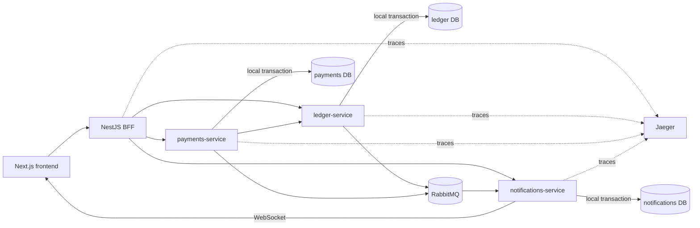

# P2P Ledger

## Project overview

Distributed P2P payments test project built by extending the supplied starter
repository. It demonstrates an event-sourced, double-entry ledger; durable
transfer sagas; split bills; idempotent event delivery; a realtime activity
feed; and a Next.js frontend.

The system contains:

- `ledger-service` — wallets and authoritative financial history;
- `payments-service` — transfers, sagas and split bills;
- `notifications-service` — activity feed and WebSocket delivery;
- `gateway-service` — frontend-facing NestJS BFF;
- Next.js App Router frontend;
- one PostgreSQL database per stateful service;
- RabbitMQ and Jaeger.

## Architecture



Solid arrows are synchronous HTTP or realtime communication. RabbitMQ carries
asynchronous integration events. Services never query another service's
database.

## Service boundaries

### Ledger

Owns users, wallets, immutable event streams, double-entry postings, holds,
balance projections, replay/rebuild and reconciliation. It is the only source
of truth for money.

### Payments

Owns transfer and split-bill workflow state, API idempotency, saga retries,
timeouts and compensation. It moves money only through ledger APIs.

### Notifications

Owns its durable consumer inbox and user activity feed. It deduplicates broker
events and publishes user-scoped WebSocket updates, but never owns balances or
transfer state.

### Gateway and frontend

The stateless NestJS BFF forwards authenticated context and aggregates service
responses without duplicating domain rules or reading service databases.
NestJS REST was retained instead of introducing GraphQL because the starter
already used NestJS/REST and had no GraphQL foundation.

The Next.js frontend uses Server Components for initial authoritative reads and
Client Components for mutations, live state and reconnect handling. Access and
refresh tokens remain in `httpOnly` cookies.

## What was preserved and refactored

The existing NestJS apps, TypeORM conventions, JWT auth, REST contracts,
Next.js App Router pages and npm-per-app structure were preserved. Public
wallet/auth APIs remain compatible where practical.

The starter's mutable wallet balance was refactored because it could not safely
handle concurrent spending or provide an auditable history. Balance is now a
rebuildable projection of immutable events and postings. Payments,
notifications, the BFF and infrastructure were extended in their existing
skeletons rather than recreated.

## Core design

### Event Sourcing, Double-entry and CQRS

Financial events are append-only and versioned. Each wallet stream uses
optimistic concurrency, so two commands cannot append the same stream version.
Historical events are protected from update/delete at the database boundary,
and each event carries a schema version. Version-specific handlers adapt older
payloads during replay instead of rewriting stored events.

PostgreSQL was used as the Event Store to preserve the existing TypeORM stack
and atomically commit events, postings and projections without adding another
database solely for the test task.

Every finalized operation writes balanced debit and credit postings:

```text
sum(debits) == sum(credits)
```

The command path authorizes, replays state, validates invariants and appends
events. Queries read the wallet balance projection. Projections can be rebuilt
deterministically, and reconciliation compares them with event-derived state.

### Wallets and holds

Wallet uniqueness is enforced for `(ownerId, currency)`. A wallet exposes:

```text
total balance
held balance
available = total - held
```

Place, release and settle-hold commands use stable business IDs and are safe to
retry. Stream concurrency prevents concurrent holds or withdrawals from
overspending available funds.

### Transfers and Saga

`payments-service` orchestrates the transfer lifecycle:

```text
Pending -> Validating -> FundsHeld -> Processing -> Completed
                         |
                         -> Compensating -> Failed
```

The saga validates the request and receiver, applies policy checks, places a
sender hold and settles debit/credit in the ledger. Temporary failures use
bounded timeout, retry and backoff. A recovery worker resumes persisted
in-progress transfers and is safe across multiple instances.

If a terminal failure occurs after a hold, the saga releases it. Settlement and
release use the transfer ID as an idempotent command ID, so retries cannot
duplicate money. If settlement committed but its response was lost, ledger
reports that fact and the saga completes instead of compensating a successful
transfer.

Compensation by step is intentionally small: validation has no side effect;
failed hold placement is safely retried or released if its outcome is
ambiguous; failed settlement releases the hold; completion publication is
recovered from the outbox and does not roll back settled money.

### Idempotency

`POST /transfers` requires `Idempotency-Key`. A canonical request fingerprint
and unique `(senderUserId, idempotencyKey)` constraint guarantee:

- same key and payload returns the existing transfer;
- same key with a different payload returns `409`;
- concurrent same-key requests create one transfer;
- the guarantee survives restart.

Broker consumers use a durable processed-event table keyed by `eventId`, so
at-least-once delivery does not duplicate activity or financial effects.

Correctness-critical database indexes enforce unique event IDs, stream
versions, wallet owner/currency and transfer idempotency keys. Additional
indexes support due-saga/outbox recovery, owner-scoped wallets and chronological
activity queries.

### Multi-currency and FX

Wallets support USD, EUR and UAH. A cross-currency transfer stores both source
and destination amounts plus an immutable FX quote. Conversion uses integer
minor units and rational rates with deterministic half-up rounding; JavaScript
floating point is not authoritative.

The bundled provider uses deterministic local rates so tests do not depend on
an external market API. The same persisted quote is reused after retry or
restart. A pre-hold policy step rejects unsupported currencies, stale quotes,
amounts over `MAX_TRANSFER_AMOUNT` and configured blocked receivers.

### Split bills

Split bills support equal and custom shares. Money is stored in integer minor
units, and custom shares must exactly equal the bill total. Equal splits
distribute remainder cents deterministically.

Each participant can pay only their own share. Payment creates a normal
idempotent transfer and uses the same saga and ledger path; there is no separate
balance mutation. Status is derived from completed shares:

```text
Pending -> PartiallyPaid -> Settled
```

Overdue unpaid shares produce one durable reminder event, which appears in the
participant's activity feed.

### Outbox and consistency

Ledger and payments store integration events in a transactional outbox together
with their local state change. A retrying relay later publishes them to
RabbitMQ. Notifications records its dedupe marker and activity item in one
local transaction.

RabbitMQ was chosen over Kafka and Redis Streams because this project needs
durable queues, routing and at-least-once delivery with low local operational
cost. Outbox/inbox handling provides reliability; the broker is not treated as
exactly-once.

Consistency is:

- **strong inside one service transaction** — ledger event/postings/projection,
  payments saga state, and notifications inbox/activity;
- **eventual across services** — a completed transfer may appear in payments
  shortly before its notification becomes visible.

### WebSocket and activity feed

Notifications authenticates Socket.IO connections with the existing
`httpOnly` access cookie and places each socket only in its JWT-derived user
room. Clients cannot subscribe to another user's channel.

WebSocket push is a refresh signal, not a source of truth. After reconnect the
frontend reloads wallet, transfer and activity state from the BFF. The activity
API supports limit, cursor pagination and event-type filtering.

## Security and resilience

- Wallet, transfer, split-bill and activity access is scoped to the
  authenticated JWT principal; client-supplied identity is not trusted.
- Admin routes are protected in both BFF and ledger. Normal users neither see
  the navigation item nor gain access by opening `/admin` directly.
- DTO validation rejects malformed, zero, negative and non-finite amounts;
  global whitelist validation removes unknown fields.
- Payments-to-ledger commands require a service token and remain idempotent.
- CORS uses an explicit origin list; frontend mutations enforce same-origin
  requests.
- Login and transfer creation are rate-limited. Rate limiting does not replace
  idempotency.
- Ledger calls have bounded timeouts, retries, backoff and circuit isolation.
- SQL paths bind user input, React escapes rendered data, and API errors do not
  expose stack traces.
- Structured logging redacts passwords, tokens, cookies, authorization headers
  and secrets.

Access-token refresh happens server-side. Middleware refreshes protected page
navigation, while the BFF proxy refreshes and retries one failed API request.
Invalid refresh tokens clear the cookies; logout clears both tokens.

## Observability

OpenTelemetry propagates trace and correlation context through HTTP and broker
events across BFF, payments, ledger and notifications. Services emit structured
logs with service, trace, correlation and relevant transfer/aggregate IDs.

Each NestJS service exposes Prometheus-compatible `/metrics` for HTTP requests,
transfer outcomes, saga timing/retries, compensation, outbox backlog, consumer
failures and reconciliation failures. Jaeger is available locally, and the
admin screen shows recent trace summaries and saga-step timings.

## API documentation

Swagger UI and OpenAPI JSON are generated from the actual REST controllers:

- ledger: http://localhost:3001/docs
- payments: http://localhost:3002/docs
- notifications: http://localhost:3003/docs
- gateway/BFF: http://localhost:3004/docs

## Found starter-code problems

### Wallet IDOR

- **Problem:** an authenticated user could read, deposit to or withdraw from a
  wallet by supplying another user's wallet ID.
- **Reproduction:** authenticate as user A and call a wallet endpoint with user
  B's ID.
- **How found/tested:** controller/service review plus owner-versus-other-user
  regression tests for read, deposit and withdraw.
- **Fix:** identity comes from the JWT principal and wallet lookup is scoped by
  both wallet ID and owner ID. Foreign and missing wallets consistently return
  `404`.

### False-positive async test

- **Problem:** the insufficient-funds test neither awaited nor returned the
  withdrawal promise. Its assertion existed only in `.catch()`, so a wrong
  successful implementation could still pass.
- **Reproduction:** remove the insufficient-funds exception; the original test
  remained green.
- **How found/tested:** async test audit for missing `await`/`return`.
- **Fix:** the test now uses `await expect(...).rejects`, verifies the expected
  error and asserts that persistence was not called.

No `.skip`, `xit`, `xdescribe` or test TODO markers remain.

### Concurrent double spending

- **Problem:** the starter performed read-check-write on mutable balance.
  Concurrent withdrawals read the same old value and could all succeed.
- **Reproduction:** parallel withdrawals whose total exceeds the starting
  balance.
- **How found/tested:** deterministic PostgreSQL concurrency tests for two
  large withdrawals, many withdrawals, concurrent deposits and holds.
- **Fix:** financial commands replay the wallet stream and append with an
  expected version in one transaction. A unique stream-version constraint
  forces conflicting commands to reload and revalidate.

The regression proves that two withdrawals of `80` from `100` allow exactly
one success, and a larger 100-request scenario never spends more than available.

### Other starter cleanup

- Wallet creation is lazy and protected by unique `(ownerId, currency)`;
  concurrent creation returns the existing logical wallet.
- Frontend auth forwarding was repaired by the same-origin BFF and
  `httpOnly` cookie flow.
- Missing lockfiles and incomplete CI scripts were aligned with `npm ci`,
  lint, builds, unit and integration tests.
- Docker production entrypoints now use the actual clean Nest build location
  `dist/src/main`.

## Running locally

### Docker Compose

From a clean checkout:

```bash
docker compose up -d --build
docker compose ps
```

Main endpoints:

- frontend: http://localhost:3000
- gateway: http://localhost:3004
- RabbitMQ UI: http://localhost:15672
- Jaeger: http://localhost:16686
- PostgreSQL: ledger `5433`, payments `5434`, notifications `5435`

Local Compose credentials are development-only and documented in
`docker-compose.yml` and the service `.env.example` files.

### Run apps on the host

Each app has an ignored local `.env` configured for the Compose databases and
infrastructure:

```bash
cd apps/ledger-service
npm ci
npm run start:dev
```

Repeat for payments, notifications, gateway and frontend in separate terminals.

## Tests

Every app has its own generated `package-lock.json` and uses `npm ci`.

### Unit, lint and build

```bash
cd apps/ledger-service
npm ci
npm run lint
npm run build
npm test -- --runInBand --no-watchman
```

Use the same commands in:

- `apps/payments-service`
- `apps/notifications-service`
- `apps/gateway-service`
- `apps/frontend` (its test command is simply `npm test`)

### Integration tests

With the three test PostgreSQL databases available:

```bash
cd apps/ledger-service
npm run test:integration:concurrency
npm run test:integration:event-store
npm run test:integration:migration

cd ../payments-service
npm run test:integration:persistence
npm run test:integration:transfers
npm run test:integration:saga
npm run test:integration:split-bills

cd ../notifications-service
npm run test:integration:persistence
```

These cover event append/replay/version conflicts, projection rebuild,
double-entry, holds, authorization, API idempotency, saga compensation/restart,
FX, split bills, outbox and durable consumer deduplication.

### Full system verification

After Compose is healthy:

```bash
node scripts/verify-system-correctness.mjs
```

The harness verifies:

- registration, login and protected APIs;
- same- and cross-currency transfers and projections;
- persisted FX quote and policy rejection;
- sequential/concurrent idempotency;
- ledger outage retry and recovery;
- broker duplicate delivery;
- reconciliation and event-stream integrity;
- WebSocket reconnect with authoritative refetch;
- a 100-request double-spend scenario.

The script uses deterministic polling rather than arbitrary sleeps and exits
non-zero on the first invariant violation. Failure-after-hold compensation and
restart recovery are covered by the payments saga integration suite; user-room
isolation is covered by the notifications WebSocket E2E suite.

## Race/load test result

Latest successful system run:

```text
starting balance:          1000.00
concurrency / attempts:    100 / 100
amount per attempt:        100.00
attempted total:           10000.00
expected max successes:    10
actual successes:          10
final balance:             0.00
final held:                0.00
final available:           0.00
reconciliation:            true
duration:                  564 ms
```

The direct ledger integration variant completed in 174 ms. Both runs verified
non-negative available balance, unique ordered events, no duplicate postings
and projection consistency. Durations are local evidence, not benchmarks.

## CI

`.github/workflows/ci.yml` runs lockfile install, lint, build/typecheck, unit
tests and PostgreSQL integration suites for each service. A separate job
validates Compose and runs the full system-correctness harness. Existing checks
were not removed to make CI green.

## Known limitations

- The FX table is deterministic local configuration, not a live market feed.
- Fraud policy provides limits and blocklists, not production risk scoring.
- Rate-limit and circuit-breaker state is process-local; a scaled deployment
  would use shared/edge enforcement.
- Local credentials are development defaults. Production needs secret
  management, TLS/workload identity, broker ACLs and private metrics access.
- Production dashboards, alert rules and centralized log storage are not
  provisioned.
- `npm audit` reports dependency advisories; breaking automatic upgrades were
  intentionally left for a separate compatibility review.
- On the latest local machine, a clean Docker rebuild was blocked while Docker
  Desktop resolved the missing `node:20-alpine` image. Compose configuration,
  host builds/tests and a prior full runtime E2E passed.

## Requirements scorecard

| Requirement | Status | Evidence |
|---|---|---|
| Three NestJS services, BFF and Next.js frontend | DONE | `apps/*`, Compose, builds |
| Database ownership per service | DONE | three PostgreSQL data sources and boundary tests |
| JWT auth, refresh and IDOR protection | DONE | guards, BFF cookie flow, authorization tests |
| Wallet per user/currency invariant | DONE | unique constraint and concurrency tests |
| Multi-currency and persisted FX | DONE | FX migration, quote service and cross-currency tests |
| Append-only Event Store and optimistic concurrency | DONE | migrations and event-store integration suite |
| Double-entry and CQRS projections | DONE | journal, rebuild and reconciliation tests |
| Idempotent holds and concurrent spending protection | DONE | hold and race integration tests |
| Durable transfer idempotency | DONE | unique key/fingerprint and concurrent tests |
| Saga, compensation, retry and recovery | DONE | persisted saga and integration tests |
| Fraud/limits decision step | DONE | policy service and terminal-rejection tests |
| Split bills and reminders | DONE | split-bill integration suite |
| Outbox and consumer deduplication | DONE | persistence and duplicate-delivery tests |
| Activity feed and authenticated WebSocket | DONE | API/socket isolation and reconnect tests |
| Admin event log, reconciliation and traces | DONE | guarded admin APIs/UI and tests |
| Tracing, structured logs and metrics | DONE | OpenTelemetry, JSON loggers and `/metrics` |
| Login and transfer rate limits | DONE | guards and tests |
| Swagger/OpenAPI | DONE | `/docs` and `/docs-json` in four Nest apps |
| CI lint/build/unit/integration/system jobs | DONE | GitHub Actions workflow |
| Full system correctness harness | DONE | successful recorded E2E and load report |
| Latest clean Docker image rebuild | PARTIAL | Docker Desktop image-resolution blocker |

`DONE` means implemented and backed by repository evidence. The final Docker
row remains `PARTIAL` until the image can be rebuilt on a Docker engine with
working registry access.
